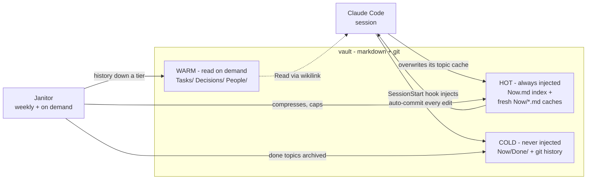

# HearthVault

<p align="center"></p>

**Tiered markdown memory for Claude Code.** An Obsidian-compatible vault your agent maintains for you: a small hot tier injected at every session start, deeper tiers read on demand, and a weekly janitor that keeps the hot tier from growing. No database, no embeddings — markdown, git, three hooks, one scheduled agent.

## 🚀 Install

One line, no manual cloning:

```bash
curl -fsSL https://raw.githubusercontent.com/BorisNikolic/hearthvault/main/install.sh | bash
```

The installer asks three questions — your vault's name (`Brain`, `MyBrain`, or a full path), your first project/client folder's name, and where you keep the projects this vault should cover — then does everything:

1. creates the vault as a git repo, with your project folder already named,
2. installs the three hooks and the `/vault-cleanup` command,
3. registers the hooks in `~/.claude/settings.json` (idempotent, with a backup),
4. **asks to schedule the weekly janitor** (macOS launchd, Mondays 08:07) — answer `y` and it installs and loads the schedule itself, no manual `launchctl` step. Skip it and you can still run `/vault-cleanup` by hand anytime.

Non-interactive / from a clone:

```bash
git clone https://github.com/BorisNikolic/hearthvault.git && cd hearthvault
./install.sh MyBrain Acme "$HOME/dev:$HOME/experiments"   # vault, project folder, work dirs
```

Requirements: [Claude Code](https://claude.com/claude-code), `git`, `jq`. The launchd schedule is macOS-only (hooks are portable; use cron/systemd elsewhere).

After install: start a Claude Code session in the vault — the hot cache loads automatically. Settings live in `~/.config/hearthvault/config` (vault path, extra work dirs that receive context, freshness window).

**Uninstall** (removes hooks, command, schedule, config — **never your notes**):

```bash
curl -fsSL https://raw.githubusercontent.com/BorisNikolic/hearthvault/main/uninstall.sh | bash
```

Your vault and its full git history stay on disk untouched; delete that folder yourself if you truly want the data gone.

**Obsidian is optional.** The mechanism is plain markdown, shell hooks, and git — the agent reads and greps files directly, and `[[wikilinks]]` are just a linking convention it follows. Opening the vault in [Obsidian](https://obsidian.md) gives *you* a nice human interface (graph view, backlinks, search), but nothing breaks without it. No plugins required either way.

## 🔥 How it works

Sessions are ephemeral; the vault remembers. Content settles downward through three tiers, so the always-injected part stays a few thousand tokens forever:



| Tier | Contents | In context |
|---|---|---|
| **🔥 Hot** | `Now.md` index (≤10 KB) + `Now/<topic>.md` caches touched in the last 14 days (~5 KB each) | injected at every session start |
| **🪵 Warm** | `Tasks/` (durable record per ticket), `Decisions/`, `People/` (profiles of collaborators) | agent Reads via wikilinks when relevant |
| **🧊 Cold** | `Now/Done/` archive, processed transcripts, full git history | never — nothing is deleted, it settles here |

The **session** writes only to its own topic's cache (parallel sessions never collide), overwrites instead of appending, and every edit auto-commits — git is the undo. The **janitor** (`/vault-cleanup`, weekly or manual) archives finished topics, compresses over-budget caches, files decisions verbatim, refreshes indexes, and validates links.

Relations between notes are a **small typed graph in frontmatter** (`owner`, `blocks`, `blocked_by`, `supersedes`, `covers`, `decided_by`, `relates_to`) — greppable, queryable, no graph database.

### 📥 The Inbox

Drop raw material into `Inbox/` — a meeting transcript, an exported doc, a pasted email. The next session picks it up: the agent reads each file, extracts decisions into `Decisions/`, facts into the right topic notes, moves the raw file to `Inbox/Processed/`, and refreshes the hot cache.

**Important: only sessions started *inside the vault folder* trigger Inbox processing.** Sessions in your work dirs deliberately don't — they're for coding, and shouldn't get derailed into filing meeting notes. So the flow is: drop the file in, `cd` into the vault, start a session and send a message — processing begins with your first message, not with the session launch itself (the hook only injects context; the agent acts when you prompt it). "Process the inbox" is plenty. Or just let the weekly janitor sweep up whatever's left. Nothing watches the folder in real time. The agent is told to verify claims against reality before filing them (transcripts lie).

## 🔧 Details worth knowing

- **Your code repos get the memory too.** The installer asks where you keep your projects; any session started under one of those directories receives the hot tier — you don't have to work inside the vault for the agent to remember your project. Add or change paths anytime in `~/.config/hearthvault/config` (`WORK_DIRS`, colon-separated).
- **Memory survives `/clear` and context compaction.** The injection hook fires on startup, resume, `/clear` and compaction, so a long session that compacts comes back with the hot tier fresh.
- **The third hook is a nag, on purpose.** If a session changes a vault note but doesn't refresh the matching cache, a Stop hook reminds it before the turn ends — that's what keeps the hot tier trustworthy.
- **Skipped caches are still discoverable.** The injection ends with one line naming the `Now/` caches it left out (idle > 14 days), so the agent knows they exist and can Read them.
- **`Now/_general.md`** is the cache for active work not tied to a single topic.
- **The janitor leaves a paper trail**: a summary in the vault's `.janitor-report.md` after every run, and the scheduled runs log to `~/.claude/logs/hearthvault-janitor.log`.

## 🧭 Principles

- The injected tier is a **cache with a budget**, not a journal.
- **Overwrite, don't append** — history lives in git; "Prior:" chains cap at 3.
- **Decisions move intact, never summarized.**
- **Nothing is deleted** — it settles down a tier.
- **One vault per client** — confidentiality isolation is structural, not disciplinary.
- **Discipline decays; schedules don't** — every rule is enforced by the janitor.

## 📄 License

MIT
