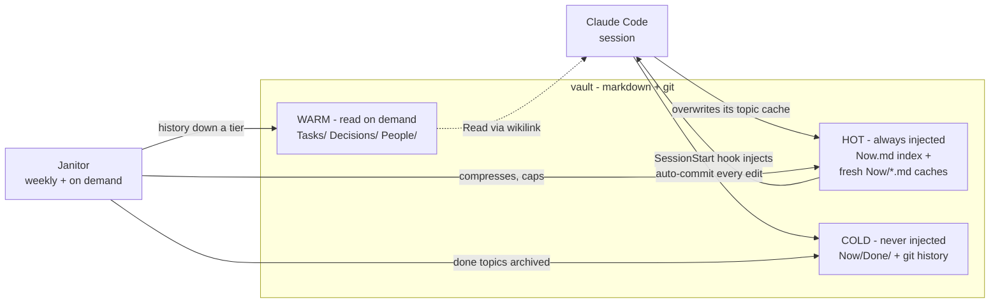

# HearthVault

**Tiered markdown memory for Claude Code.** An Obsidian-compatible vault your agent maintains for you: a small hot tier injected at every session start, deeper tiers read on demand, and a weekly janitor that keeps the hot tier from growing. No database, no embeddings — markdown, git, three hooks, one scheduled agent.

## Install

One line, no manual cloning:

```bash
curl -fsSL https://raw.githubusercontent.com/BorisNikolic/hearthvault/main/install.sh | bash
```

The installer asks for your vault's name — type `Brain`, `MyBrain`, whatever you like (or a full path) — then creates the vault as a git repo, installs the hooks and the `/vault-cleanup` command, registers the hooks in `~/.claude/settings.json` (with a backup), and offers to schedule the weekly janitor.

Non-interactive / from a clone:

```bash
git clone https://github.com/BorisNikolic/hearthvault.git && cd hearthvault
./install.sh MyBrain        # creates ~/MyBrain
```

Requirements: [Claude Code](https://claude.com/claude-code), `git`, `jq`. The launchd schedule is macOS-only (hooks are portable; use cron/systemd elsewhere).

After install: rename `Client/` inside the vault to your project's name, then start a Claude Code session in the vault — the hot cache loads automatically. Settings live in `~/.config/hearthvault/config` (vault path, extra work dirs that receive context, freshness window).

## How it works

Sessions are ephemeral; the vault remembers. Content settles downward through three tiers, so the always-injected part stays a few thousand tokens forever:



| Tier | Contents | In context |
|---|---|---|
| **Hot** | `Now.md` index (≤10 KB) + `Now/<topic>.md` caches touched in the last 14 days (~5 KB each) | injected at every session start |
| **Warm** | `Tasks/` (durable record per ticket), `Decisions/`, `People/` (profiles of collaborators) | agent Reads via wikilinks when relevant |
| **Cold** | `Now/Done/` archive, processed transcripts, full git history | never — nothing is deleted, it settles here |

The **session** writes only to its own topic's cache (parallel sessions never collide), overwrites instead of appending, and every edit auto-commits — git is the undo. The **janitor** (`/vault-cleanup`, weekly or manual) archives finished topics, compresses over-budget caches, files decisions verbatim, refreshes indexes, and validates links.

Relations between notes are a **small typed graph in frontmatter** (`owner`, `blocks`, `blocked_by`, `supersedes`, `covers`, `decided_by`, `relates_to`) — greppable, queryable, no graph database.

## Principles

- The injected tier is a **cache with a budget**, not a journal.
- **Overwrite, don't append** — history lives in git; "Prior:" chains cap at 3.
- **Decisions move intact, never summarized.**
- **Nothing is deleted** — it settles down a tier.
- **One vault per client** — confidentiality isolation is structural, not disciplinary.
- **Discipline decays; schedules don't** — every rule is enforced by the janitor.

## License

MIT
